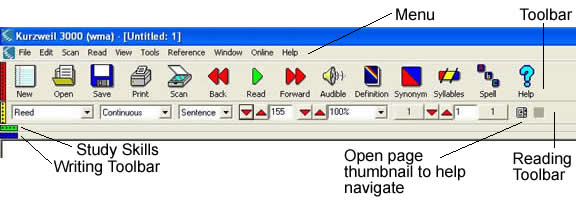
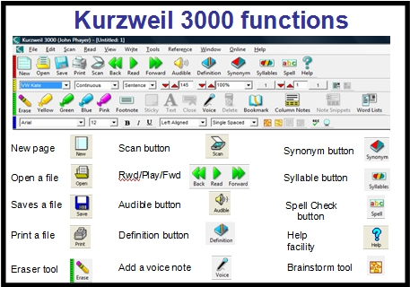

=============
Kurzweil 3000
=============

What is Kurzweil 3000
=====================

Kurzweil_ 3000 provides a comprehensive suite of supports for struggling students, including reading, writing, study skills, and test taking.

At Chelsea School, many students are introduced to Kurzweil_ 3000 as powerful tool for composition, editing, and revision.

Kurzweil_ 3000 was pioneering in the areas of text to speech (**TTS**) and optical character recognition.

According to Kurzweil's promotional copy: Using natural sounding voices, Kurzweil_ 3000 reads text aloud to students, allowing them to follow along as the text is highlighted and spoken at a self-adjusted pace. Additional literacy tools use a multisensory approach to engage students as they develop language fluency, comprehension and retention. As a result, students with language-based learning differences are able to read at a higher level than they could independently and achieve success alongside their peers.

Some students' IEPs provide for TTS accomodations during state testing. That accomodation is provided through Kurzweil_ 3000 -- but only when the student is familiar with the software.

Key Features
------------

* Text-to-speech in seven languages
* Reads any digital text aloud, including the Internet
* Multiple reference sources, including bi-lingual
* Translations to any Google supported language
* Highlighters and sticky notes
* Vocabulary study guides
* Graphic organizer
* Writing templates
* Word prediction
* Talking spell checker
* Direct access to Bookshare and other online content providers [1]_

In the Home
-----------

Chelsea School has opted to use Web-based licensing for Kurzweil- 3000. This "floating license" permits students use Kurzweil_ 3000 from a home PC with internet connectivity. [2]_

Resources
---------

* Kurzweil_ 3000 Product Information: http://www.kurzweiledu.com/products/kurzweil-3000-firefly-overview.html

* Kurzweil_ 3000 on YouTube (6:21): http://youtu.be/KbuJFsqu6x4

* Getting Started with Kurzweil_ 3000 (PDF): https://www.kurzweiledu.com/files/v13/Getting_Started_With_Kurzweil_3000_WIN.pdf

.. [1] Chelsea School has access to the Bookshare collection.

.. [2] With our Tech Mobile, Chelsea School staff are able to offer to install Kurzweil 3000 on a student's home PC.

.. index:: tts, TTS, text to speech, accessibility, Kurzweil 3000, IEP, Kurzweil, reading, writing, study skills, literacy

.. _Kurzweil: http://www.kurzweiledu.com/products/kurzweil-3000-firefly-overview.html